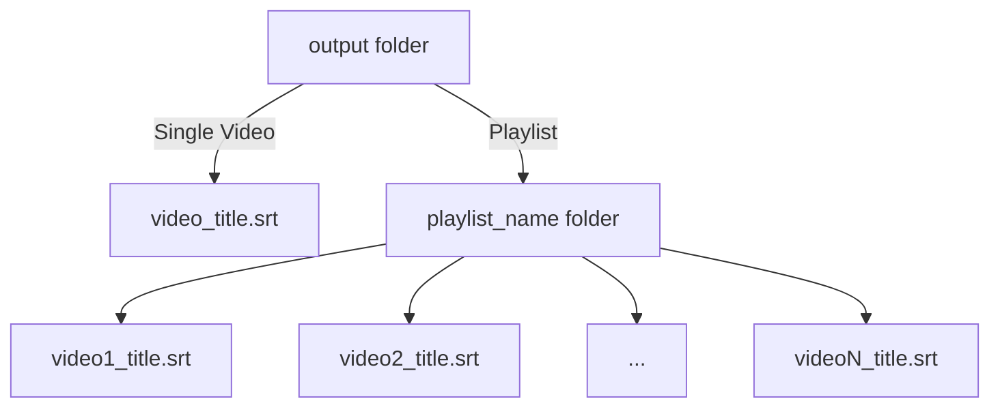

# V2 YouTube Subtitles Translator Pro

أداة متقدمة واحترافية صُممت خصيصاً لاستخراج وترجمة ترجمات مقاطع فيديو وقوائم تشغيل يوتيوب تلقائياً، مصممة بأداء عالٍ وتتضمن تقنيات ذكية للتعامل مع حظر خوادم الترجمة وتفادي التوقف المزعج أثناء العمليات الطويلة.

A professional and advanced tool designed for extracting and translating YouTube video and playlist subtitles automatically, featuring high performance with intelligent load-balancing to handle translation server limits.

## الفوائد للمستخدم العادي (Why use this?)

تُقدم هذه الأداة فوائد ملموسة للمتعلمين والمستخدمين العاديين، منها:
- **ترجمة الدورات والمحتوى التعليمي**: يمكنك إعطاء الأداة رابطاً لقائمة تشغيل (كورس كامل) وسوف تقوم باستخراج جميع الملفات النصية وترجمتها مرة واحدة لتستطيع دراستها براحة.
- **مشاهدة أوفلاين**: يمكنك تحميل الترجمة وتشغيلها مع الفيديوهات المحملة محلياً على جهازك باستخدام مشغلات مثل VLC دون الحاجة للإنترنت.
- **تجاوز قيود يوتيوب**: يوفر السكربت إمكانية سحب الترجمات الأصلية بصيغة نظيفة ومترجمة بطريقة مستقرة، حتى في الفيديوهات الطويلة التي تتسبب بانهيار أدوات المتصفح التقليدية.

## الميزات الأساسية (Key Features)

- **استخراج الترجمات مباشرة**: سحب النصوص الأصلية للفيديوهات من يوتيوب بسهولة تامة وبأدق توقيت للزمن (Timestamps).
- **ترجمة سريعة ودقيقة**: الترجمة إلى اللغة العربية (وغيرها) مدعومة بواسطة محرك `Google Translator` (عبر مكتبة `deep-translator`).
- **دعم شامل لقوائم التشغيل (Playlists)**: لا حاجة لإدخال الفيديوهات واحداً تلو الآخر؛ فقط ضع رابط القائمة وسيقوم السكربت بقراءتها كلها، والتعامل مع الفيديوهات بفاصل زمني (Delay) آمن ومدروس لتجنب الحظر من الخوادم.
- **نظام التوازن الديناميكي الأوتوماتيكي (Dynamic Load Balancing)**: يقوم السكربت بمراقبة نجاح أو فشل عمليات الترجمة. في حال وجود مشاكل أو ضغط، يقوم بتقليل حجم النصوص المدمجة (Chunk Size) وتقليص عدد العمليات المتزامنة (Workers) تلقائياً لتجنب الحظر، ثم يعيد زيادتها تدريجياً عند استقرار الاتصال.
- **ترجمة متزامنة ومتعددة المسارات (Multithreading)**: تسريع عملية الترجمة بشكل كبير بدلاً من الترجمة سطرًا بسطر.

## شكل المخرجات (Output Format)

السكربت منظم جداً في طريقة حفظ الملفات:
1. سيقوم بإنشاء مجلد رئيسي باسم `output` بجانب السكربت.
2. إذا قمت بإدخال **رابط فيديو مفرد**: سيتم حفظ ملف الترجمة النهائي داخل المجلد يحمل اسم الفيديو الأصلي بصيغة `.srt` (الصيغة القياسية للترجمات).
3. إذا قمت بإدخال **رابط قائمة تشغيل (Playlist)**: سيقوم بإنشاء مجلد فرعي داخل `output` يحمل اسم قائمة التشغيل، وداخله ستجد جميع ملفات الترجمة `.srt` للفيديوهات مُرتبة ومنظمة لتسهيل استخدامها.

### خريطة توضيحية لشكل المخرجات:



## المتطلبات (Prerequisites)

يعتمد هذا المشروع على لغة بايثون (Python 3.x). يجب تثبيت المكتبات التالية قبل تشغيل السكربت:

```bash
pip install youtube-transcript-api deep-translator yt-dlp requests
```

## طريقة الاستخدام (Usage)

قم بتشغيل السكربت عبر بيئة الأوامر (Terminal) في مسار تواجد الملف:

```bash
python "V2 YouTube subtitles translator pro.py"
```

بمجرد عمل السكربت، سيطلب منك إدخال الرابط. يمكنك لصق التالي:
- رابط فيديو عادي (مثال: `https://www.youtube.com/watch?v=...`)
- معرف فيديو فقط (Video ID)
- رابط قائمة تشغيل كاملة (مثال: `https://www.youtube.com/playlist?list=...`)

## ملاحظات هامة

- تم ضبط الإعدادات الافتراضية للترجمة لتكون قوية بـ 10 مسارات معالجة متزامنة (Workers)، مع إمكانية النظام خفض الموارد تدريجياً إذا استُشعر أي رفض للاتصال من قِبل جوجل للترجمة.
- يفضل أن يكون لديك اتصال إنترنت جيد للتعامل مع الترجمة الموازية الكثيفة للفيديوهات الطويلة.
